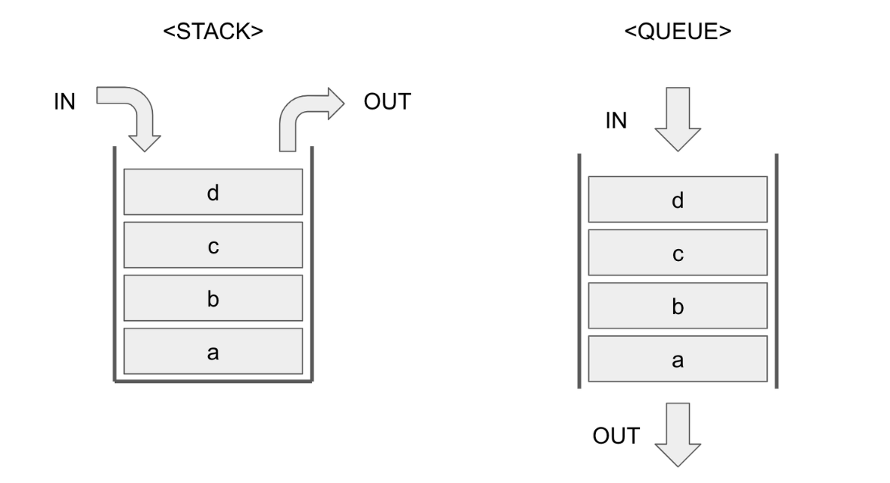
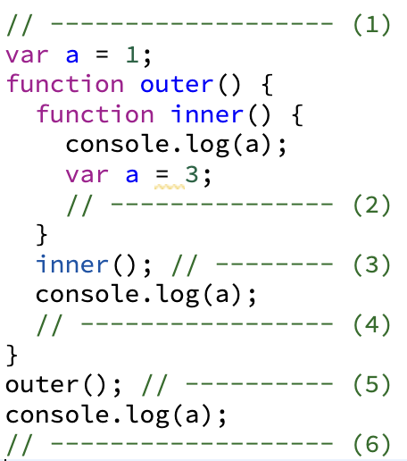
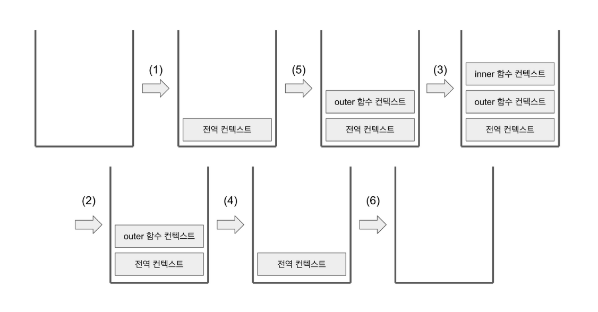
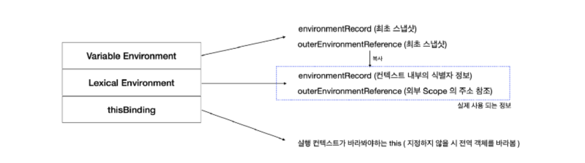
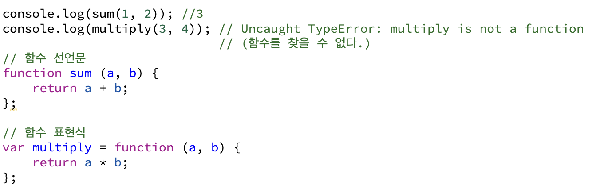
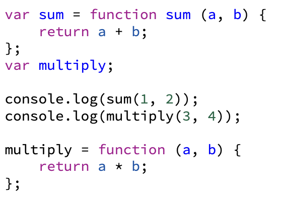
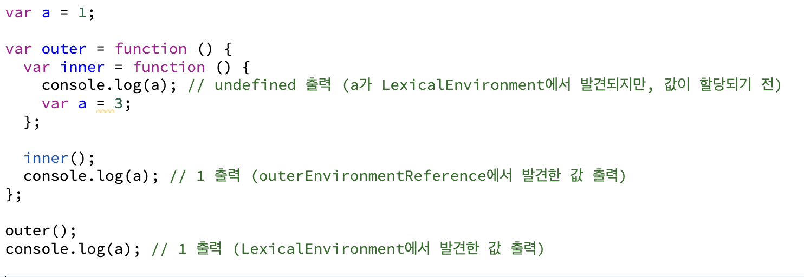

# 2장 실행 컨텍스트

 

## 실행컨텍스트

 

### 1) Stack & Queue

 

#### Stack: LIFO (Last In First Out)

#### Queue: FIFO (First In First Out)

Stack에서는 가장 마지막에 들어온 d,c,b,a 순으로 데이터를 꺼낼 수 있습니다.

Queue에서는 제일 먼저 들어온 a,b,c,d 순으로 데이터를 꺼낼 수 있습니다.

### 2) 실행 컨텍스트

 
실행 컨텍스트란 실행할 코드에 제공할 환경 정보들을 모아 놓은 객체입니다.

실행 컨택스트의 동작은, 동일한 환경에 있는 코드들을 실행할 때 필요한 환경정보를 모아 컨텍스트를 구성하고, 이를 콜 스택에 쌓아놓은 뒤, 가장 위에 있는 컨텍스트와 관련 있는 코드들을 실행하는 것으로 코드의 환경과 순서를 보장합니다.

#### 하나의 실행 컨텍스트를 구성할 수 있는 방법으로는 다음과 같다.

- 전역 공간
- evel() 함수
- 함수

흔히 실행 컨텍스트를 구성하는 방법은 함수를 실행하는 것입니다. 어떤 실행 컨텍스트가 활성화될 때 자바스크립트 엔진은 해당 컨텍스트에 관련된 코드들을 실행하는데 필요한 환경 정보들을 수집해서 실행 컨텍스트 객체에 저장합니다.

### 3) 실행 컨텍스트와 콜 스택

 

 
 * 실행 순서 : (1) → (5) → (3) → (2) → (4) → (6)
 * 코드 실행시, 전역공간이 활성화되면서 전역 컨텍스트가 생성되고 함수 호출 순서대로 콜스택에 실행 컨텍스트가 쌓이는것을 확인할 수 있습니다.

 

### 4) 실행 컨텍스트의 구조

## 

- 실행 컨텍스트 객체는 활성화되는 시점에 VariableEnvironment, LexicalEnviornment, ThisBinding 세 가지 정보 수집합니다.

---

## VariableEnvironment & LexicalEnvironment

### 1) VariableEnvironment

실행 컨텍스트를 생성할 때, VariableEnvironment에 정보를 먼저 담은 후 이를 그대로 복사해서 LexicalEnvironment를 만들고 이후에 LexicalEnvironment를 주로 활용하게 됩니다. 실행중에도 변경사항이 반영되지 않으며 초기 상태를 유지합니다.

내부 구성 요소 : 현재 컨텍스트 내의 식별자들에 대한 정보 + 외부 환경 정보가 선언 시점의 스냅샷으로 저장

- environmentRecord (snapshot)
- outerEnvironmentReference (snapshot)

### 2) LexicalEnvironment

내부 구성 요소 : VariableEnvironment와 동일하지만 변경 사항이 실시간으로 반영

- environmentRecord
- outerEnvironmentReference

### 3) environmentRecord와 호이스팅

#### 3-1) environmentRecord

environmentRecord는 현재 컨텍스트와 관련된 코드의 식별자 정보들이 저장됩니다. 컨텍스트 내부 전체를 처음부터 훑어나가며 순서대로 수집(매개변수 이름, 함수 선언, 변수명 등)합니다. 변수 정보를 수집하는 과정을 모두 마쳤더라도 아직 실행 컨텍스트가 관여할 코드들은 실행되기 전의 상태입니다.

#### 3-2) Host Object(호스트 객체)

- 전역 실행 컨텍스트는 변수 객체를 생성하는 대신 전역 객체를 활용한다.
- 브라우저의 Window 객체, Node의 Global 객체 등이 이에 해당한다.
- 이들은 Host Object로 분류된다.

**호이스팅(hoisting)** 은 변수 정보를 수집하는 과정을 더욱 이해하기 쉬운 방법으로 대체한 가상의 개념입니다. (실제로 자바스크립트 엔진이 끌어올리지는 않습니다)

**environmentRecord** 는 변수명만 끌어올리고 할당 과정은 그대로 남겨두게 되는데, 이러한 이유로 아래 함수 선언문과 함수 표현식에서 차이가 발생합니다.

#### 3-3) 함수 선언문과 함수 표현식

아래 코드는 호이스팅을 마친 상태입니다.

함수 선언문은 정의부만 존재하고 별도의 할당 명령이 없기 때문에 함수 전체가 호이스팅 되었습니다.

함수 표현식은 변수로 선언된 선언부만 호이스팅 되었고, 할당부는 원래 자리에 있습니다.

---

## outerEnvironmentReference와 scope, scopeChaining

**스코프(scope)**란 **식별자(변수)**에 대한 유효범위입니다. '식별자의 유효범위'를 안에서부터 바깥으로 차례로 검색해나가는 것을 스코프 체인(scope chain)이라고 합니다. 그리고 이것을 가능하게 하는 것이 **LexicalEnvironment**의 두 번째 수집 자료인 **outerEnvironmentReference** 입니다. **outerEnvironmentReference** 는 해당 함수가 선언된 위치의 **LexicalEnvironment**를 참조합니다. 여러 스코프에서 동일한 식별자를 선언한 경우, 스코프 체인 상에서 가장 먼저 발견된 식별자에만 접근 가능합니다.

 

 
* 위 사진 설명

#### 1-1) 전역 컨텍스트

- environmentRecord: { a, outer } 식별자 저장
- outerEnvironmentReference : 아무것도 담겨있지 않음

#### 1-2) outer 실행 컨텍스트

- environmentRecord: { inner } 식별자 저장
  전역에서 선언되었기 때문에, 전역 컨텍스트의
- LexicalEnvironment 참조 복사
- outerEnvironmentReference : [ GLOBAL, { a, outer } ] 표기 (첫번째는 실행 컨텍스트 이름, 두번째는 environmentRecord 객체)

#### 1-3) inner 실행 컨텍스트

- environmentRecord: { a } 식별자 저장
- outer 함수 내부에서 선언됐으므로 outer 함수의 LexicalEnvironment 참조 복사
- outerEnvironmentReference : [ outer, { inner } ]

### 전역변수와 지역변수

전역변수란 전역공간에서 선언한 변수, 전역 컨텍스트의 LexicalEnvironment에 담긴 변수

지역변수란 함수 내부에서 선언한 변수, 함수에 의해서 생성된 실행 컨텍스트의 변수

안전한 코드 구성을 위해 전역변수의 사용을 최소화 해야합니다.

---

## this

실행 컨텍스트의 thisBinding에는 this로 지정된 객체가 저장됩니다. 실행 컨텍스트 활성화 당시 this가 지정되지 않은 경우 this에는 전역 객체가 저장됩니다. 함수를 호출하는 방법에 따라 값이 달라집니다.

---

## 정리

### 실행 컨텍스트

- 제공할 환경 정보들을 모아 놓은 객체입니다.
- 실행 컨텍스트 객체는 활성화 되는 시점에 VariableEnvironment, LexicalEnvironment, ThisBinding의 세 가지 정보 수집합니다.
- VariableEnvironment와 LexicalEnvironment는 environmentRecord(매개 변수명, 식별자, 함수명등 수집)와 바로 직전 컨텍스트의 LexicalEnvironment 정보를 참조하는 outerEnvironmentReference로 구성됩니다.
- 실행 컨텍스트 생성할 때, VariableEnvironment는 초기상태 유지, LexicalEnvironment는 실행 도중 변경사항 즉시 반영됩니다.

### 호이스팅

- 실행 컨텍스트가 관여하는 코드의 최상단에 끌어올린다
- 변수 언건과 할당이 동시에 이루어지면 '선언부'만 호이스팅한다 => 선언문과 표현식의 차이 발생

### 스코프

- 변수의 유효범위를 말합니다
- outerEnvironmentReference는 해당 함수 선언된 위치인 LexicalEnvironment를 참조
- 전역 컨텍스트의 LexicalEnvironment까지 탐색해도 변수 찾지못하면 undefined 반환
- 전역변수: 전역 컨텍스트의 LexicalEnvironment 담긴 변수

### this

- 실행 컨텍스트 활성화하는 당시 지정된 this가 저장
  지정되지 않으면 전역 객체 저장
   
   
