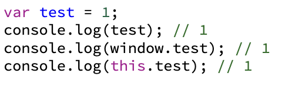
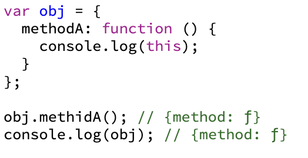
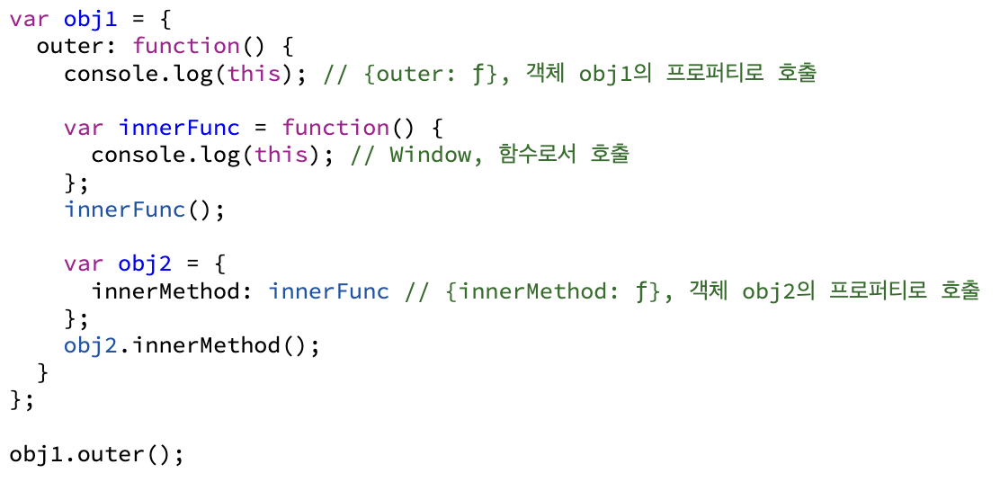
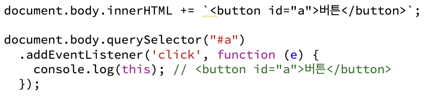
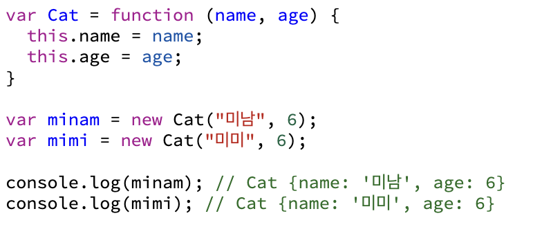
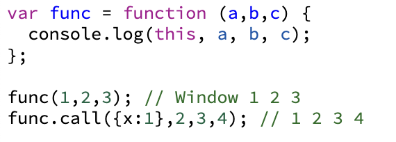
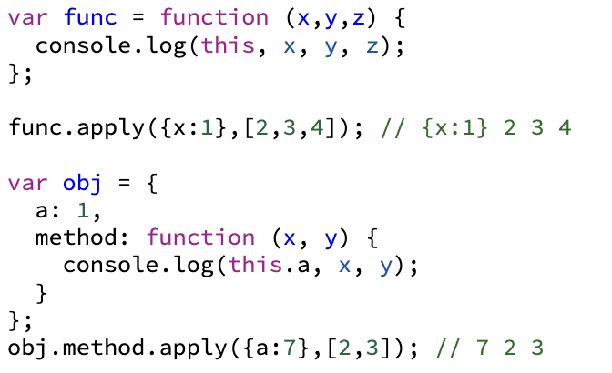
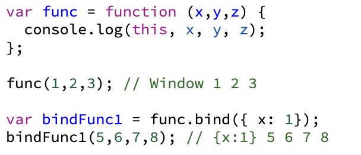
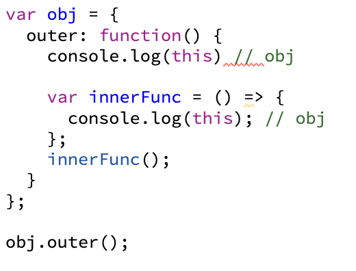

# 3장 this

 

## 1. 상황에 따라 달라지는 this

자바스크립트에서 this는 실행 컨텍스트가 생성될 때 함께 결정됩니다. this는 함수를 호출할 때 결정된다고 할 수 있습니다. 어떤 상황에서 this가 값을 결정하는지 알아보겠습니다.

 

### 1) 전역 공간에서의 this

전역공간인 this는 전역 객체를 가리키는데, 브라우저 환경에서의 전역 객체는 window이고, Node.js 환경에서는 global 입니다.

자바스크립트의 모든 변수는 특정 객체의 프로퍼티로 동작합니다. 특정 객체란, 실행 컨텍스트의 LexicalEnvironment입니다. 전역 변수를 선언하면 자바스크립트 엔진은 이를 전역 객체의 프로퍼티로 할당합니다.

 

위 예제에서 test를 직접 호출한 결과가 나오는 이유는, 변수 test에 접근하고자 하면, 스코프 체인에서 test를 검색하다가 가장 마지막의 전역 스코프의 LexicalEnvironment, 즉 전역 객체에서 해당 프로퍼티인 test를 발견하여 값을 반환합니다.
 
 

### 2) 메서드로서 호출할 때 메서드 내부에서의 this

 
함수를 실행하는 방법은 함수로서 호출하는 경우와 메서드로서 호출하는 경우가 있습니다

함수는 그 자체로 독립적인 기능을 수행합니다.

메서드는 자신을 호출한 대상 객체에 관한 동작을 합니다.

- 메서드 내부에서의 this - this에는 호출한 주체(함수명, 프로퍼티명 앞의 객체)에 대한 정보가 담깁니다. 마지막 점 앞에 명시된 객체가 곧 this가 되는 것입니다.
   
   

### 3) 함수로서 호출할 때 함수 내부에서의 this

- 함수 내부에서의 this - 어떤 함수를 함수로서 호출할 경우에는 this가 지정되지 않습니다. 함수에서의 this는 전역 객체를 가리킵니다.
- 메서드의 내부 함수에서의 this - 내부 함수 역시 함수로서 호출했는지 메서드로서 호출했는지 파악하면 this의 값을 예측할 수 있습니다.

 
* this를 바인딩하지 않는 함수 - this를 바인딩하지 않게 하기 위해 화살표 함수(arrow function)를 도입하였습니다. 
 
 

### 4) 콜백 함수 호출 시 그 함수 내부에서의 this

콜백 함수도 함수이기 때문에 특별히 정의하지 않은 경우에는 this가 전역 객체를 참조하지만, 제어권을 받은 함수에서 콜백 함수에 별도로 this가 될 대상을 지정한 경우 그 대상을 참조하게 됩니다.

위 예시에서는 addEventListener 메서드는 콜백 함수를 호출할 때 자신의 this를 상속하게 정의되어 있어 메서드 명 앞이 this가 됩니다.

### 5) 생성자 함수 내부에서의 this

생성자 함수를 호출하면 생성자의 공통 속성 및 개성을 해당 객체(this)에 부여합니다.

---

## 2. 명시적으로 this를 바인딩하는 방법

### 1) call 메서드

call 메서드를 이용하면 임의의 객체를 this로 지정할 수 있습니다.

### 2) apply 메서드

call 메서드와 기능적으로 동일하나 두 번째 인자를 배열로 받아, 요소들을 함수의 매개변수로 지정한다는 차이점이 있습니다.

### 3) bind 메서드

ES5에서 추가된 기능으로, call 메서드와 비슷하지만 즉시 호출하지 않고 넘겨받은 this 및 인수들을 바탕으로 새로운 함수를 반환하는 메서드입니다.

### 4) 화살표 함수(arrow function)의 예외사항

ES6에 새로 도입된 화살표 함수는 실행 컨텍스트 생성 시 this를 바인딩하는 과정이 제외되었습니다. 함수 내부에는 this가 아예 없으며, this에 접근하고자 하면 스코프 체인상 가장 가까운 this에 접근하게 됩니다.

arrow function을 이용하면 별도의 변수로 this를 우회하거나 call/apply, bind 메서드를 적용할 필요가 없어 간결하고 편리하게 코드를 작성할 수 있는 이점을 가지고 있습니다.

---

## 3. 정리

### 암묵적 this 바인딩

- 전역 공간에서의 this는 전역 객체를 참조합니다.
- 어떤 함수를 메서드로서 호출한 경우 this는 호출 주체(메서드명 앞의 객체)를 참조합니다.
- 어떤 함수를 함수로서 호출한 경우 this는 전역 객체를 참조합니다.
- 콜백 함수 내부에서의 this는 해당 콜백 함수의 제어권을 넘겨받은 함수가 정의한 바에 따르며, 정의하지 않은 경우에는 전역 객체 참조합니다.
- 생성자 함수에서의 this는 생성될 인스턴스를 참조합니다.

### 명시적 this 바인딩

- call, apply 메서드는 this를 명시적으로 지정하면서 함수 또는 메서드를 호출합니다.
- bind 메서드는 this 및 함수에 넘길 인수를 일부 지정해서 새로운 함수를 만듭니다.
- 요소를 순회하면서 콜백 함수를 반복 호출하는 내용의 일부 메서드는 별도의 인자로 this를 받기도 합니다.
