# 4장 콜백함수

 

## 콜백함수

- 콜백 함수(callback function)은 다른 코드의 인자로 넘겨주는 함수를 맗한다.
- “어떤 함수 A를 호출하면서 특정 조건일때 함수 B를 수행하라라는 요청”을 같이 보내는 것이라 생각하면 된다.
- 콜백 함수는 다른 코드(함수 또는 메서드)에게 인자로 넘겨줌으로서 해당 함수의 제어권을 다른 코드에 넘겨준것이다. 이 콜백 함수를 넘겨받은 함수는 코드에 따라서 적절한 로직, 시점에 함수를 실행하는 것이다.

 

## 제어권

제어권은 함수를 어떤 시점, 어떤 인자를 넘길것인지를 결정하는 것이라 생각하자.
setTimeout()을 호출하는 것은 사용자이다. 하지만 setTimeout()에 넘겨준 함수를 호출하는 것은 setTimeout()이 되는 것이며 제어권 또한 setTimeout()이 가지고 있는것이다.

콜백 함수의 제어권을 넘겨받은 코드는 콜백 함수를 호출할 때 인자에 어떤 값들을 어떤 순서로 넘길것인지를 제어하는 제어권을 갖고 있는 것이다.
콜백 함수도 결국은 함수이기 때문에 기본적으로 this에는 전역객체를 참조한다. 다만 콜백 함수에 별도의 this가 될 대상을 넘기면 콜백 함수는 해당 값을 참조 한다.

### 호출 시점

#### 예제 - setInterval

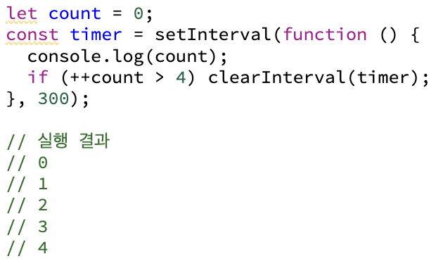
 

- 300ms 마다 카운팅 된 숫자를 출력하고 카운트가 4를 넘으면 타이머를 초기화 시켜 종료
- 300ms 마다 주기적으로 callback 함수가 호출
   

#### 예제 - setInterval cbFunc 명시적 표현

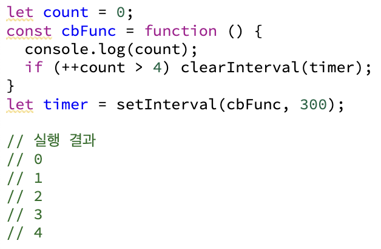

- 콜백 함수를 보다 명시적으로 표현 (cbFunc)
- cbFunc, setInterval의 호출 주체와 제어권 비교

 

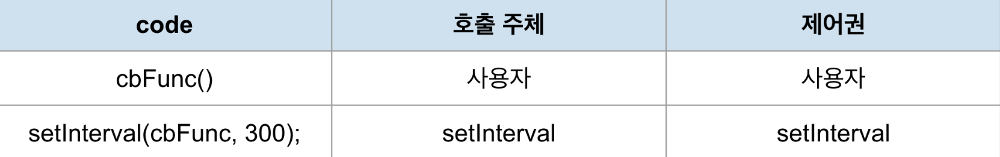
   

### 인자

#### 예제 - Array.prototype.map

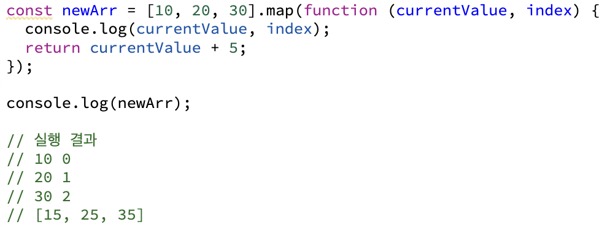
 
    

### 예제 - Array.prototype.map 인자 순서 변경

- 콜백 함수를 호출 할 때 넘기는 인자 값은 이름에 관계 없이 순서대로 값이 전달
- 전달되는 인자의 순서는 콜백 함수를 호출 주체가 되는 함수(또는 메서드)가 결정

   
   

### this

- 콜백 함수도 함수이기 때문에 기본적으로 this가 전역객체를 참조
- 하지만 제어권을 넘겨 받을 코드에서 콜백 함수에 별도로 this가 될 대상을 지정한 경우에는 그 대상을 참조

#### 예제 - Array.prototype.map 구현

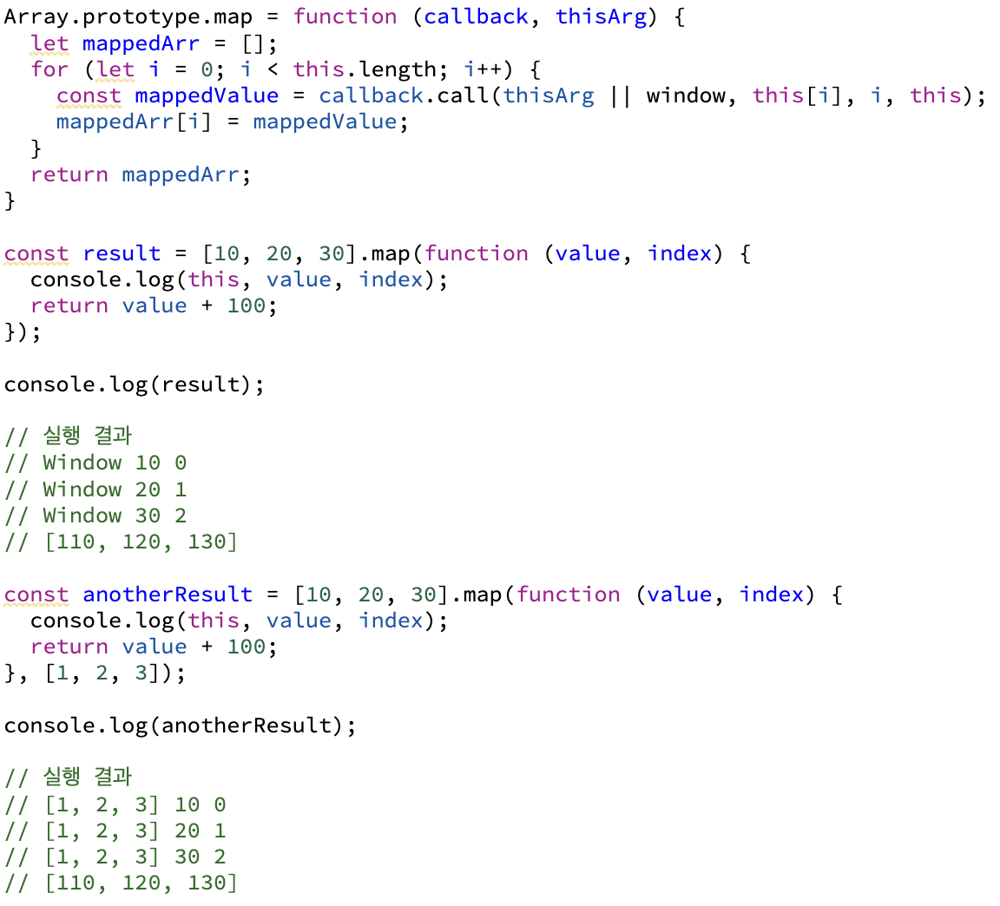
 
위 예시에서는 addEventListener 메서드는 콜백 함수를 호출할 때 자신의 this를 상속하게 정의되어 있어 메서드 명 앞이 this가 됩니다.

- thisArg가 있는 경우에는 해당 값을 콜백 함수의 this로 지정 없는 경우, 전역 객체(window)를 this로 지정

( thisArg로 넘기는 것은 콜백 함수의 this를 지정하는 것이지 map 메서드의 this를 지정하는게 아니기 때문에 결과 값에는 영향이 없는게 맞다.)

#### 예제 - addEventListener

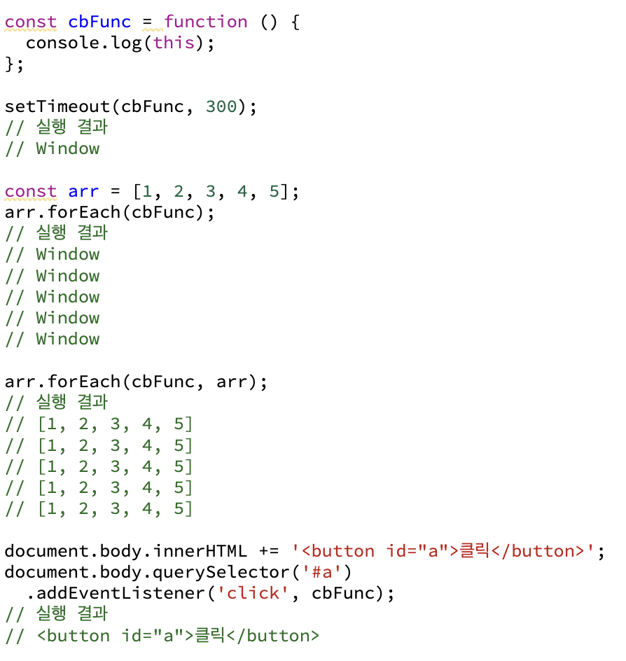

 

- setTimeout
  : 내부에서 콜백 함수를 호출할 때 call 메서드의 첫번째 인자에 전연 객체를 넘기기 때문에 콜백 함수 내부에서의 this는 전역 객체를 가리킴
- forEach
  : 별도의 인자로 this를 받는 경우. 콜백 함수 다음 인자로 this로 지정할 객체를 넘기지 않은 경우에는 this가 전역 객체를 가리키고, this로 지정할 객체를 넘긴 경우에는 this가 해당 객체를 가리킴
- addEventListener
  : 내부에서 콜백 함수를 호출 할 때 call 메서드의 첫번째 인자에 addEventListener 메서드의 this를 그대로 넘기도록 정의돼 있기 때문에 콜백 함수 내부에서 this가 addEventListener를 호출 한 주체 HTML 엘리먼트를 가리킴

---

## 콜백 함수는 함수다

콜백 함수는 함수입니다. 메서드를 콜백 함수로 전달한 경우, 메서드가 아닌 함수로서 호출됩니다.

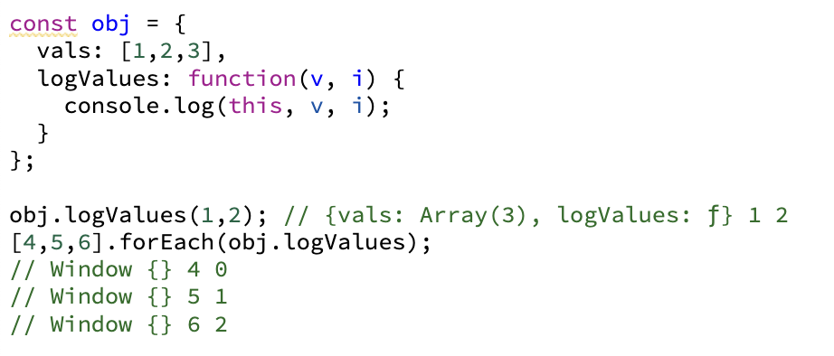

단순히 메서드로서 호출을 한 방식은, 앞에 객체가 출력되는 것을 볼 수 있지만, forEach문에 콜백 함수로 전달된 것은 콜백이 함수로서 호출되었는데, 별도로 this를 지정하는 인자를 지정하지 않았으므로 this는 전역 객체를 바라보게 되어, Window 객체가 출력되는 것을 볼 수 있습니다.

---

 

## 콜백 함수 내부의 this에 다른 값 바인딩하기

객체의 메서드를 콜백 함수로 전달하면, 해당 객체를 this로 바라볼 수 있는 방법은 this를 다른 변수에 담아 콜백 함수로 활용할 함수에서는 this대신 그 변수를 사용하게 하고, 이를 클로저로 만드는 방식이 있습니다.

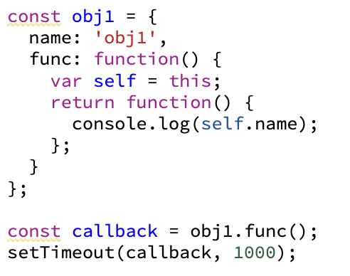

---

 

## 콜백 지옥과 비동기 제어

콜백 지옥(callback hell)은 콜백 함수를 함수로 전달하는 과정이 반복되어 코드의 들여 쓰기가 깊어지는 현상입니다. 주로 비동기적인 작업을 수행할 때, 나타나는 문제입니다. 별도의 요청(XMLHttpRequest), 실행 대기(addEventListener), 보류(setTimeout) 등과 관련된 코드는 비동기 코드입니다.

### 콜백 지옥 예시

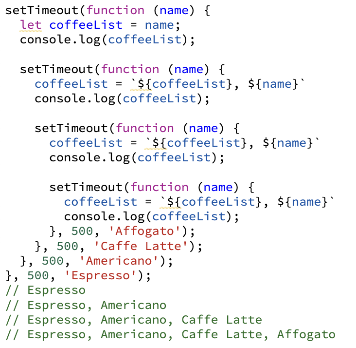
이런 콜백 지옥을 해결하기 위해, ES6에서는 Promise, Generator 등이 도입되었고, ES2017에서는 async/await가 도입됐습니다.

### Promise - 비동기 작업의 동기적 표현

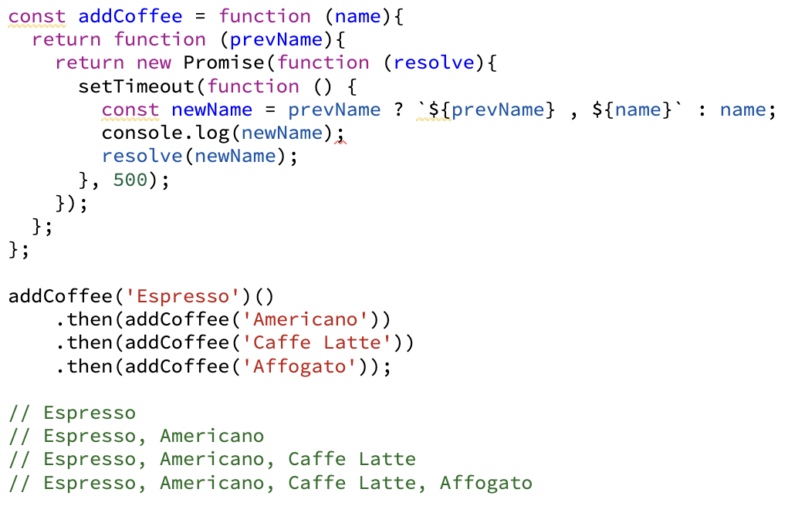

### Generator - 비동기 작업의 동기적 표현

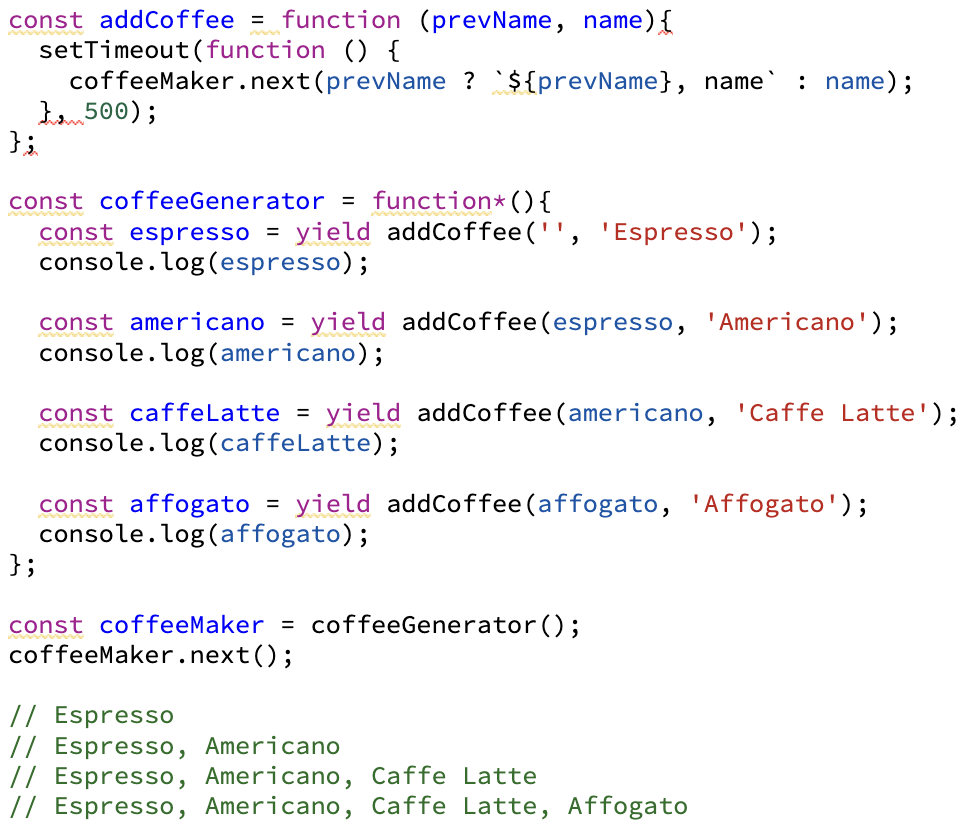

### Promise + Async/await - 비동기 작업의 동기적 표현

함수 앞에 async를 표기하고, 함수 내부에서 비동기 작업이 필요한 위치마다 await를 표기하면 뒤의 내용을 Promise로 반환되고 resolve 된 이후 다음으로 진행됩니다. 즉 Promise와 then의 흡사한 효과를 얻을 수 있습니다. 자칫하면 Promise형태도 들여 쓰기가 깊게 될 수 있는데 asnyc await을 사용하면 예방할 수 있습니다.

---

## 정리

- 콜백 함수는 다른 코드에 인자로 넘겨줌으로써 제어권까지 함께 위임한 함수
- 제어권을 넘겨받은 코드가 다음과 같은 제어권을 가짐  ㄴ 콜백 함수를 호출하는 시점을 스스로 판단해서 실행  ㄴ 콜백 함수를 호출할 때 인자로 넘겨줄 값들 및 그 순서가 정해져 있음  ㄴ 콜백 함수의 this가 무엇을 바라보도록 할지가 정해져 있는 경우도 있음. 정하지 않은 경우에는 전역 객체를 바라봄. 사용자가 임의로 this를 바꾸고 싶을 경우 bind 메서드를 활용하면 됨 
- 어떤 함수에 인자로 메서드를 전달하더라도 이는 결국 함수로서 실행됨
- 최근의 ECMAScript에는 Promise, Generator, async/await 등 콜백 지옥에서 벗어날 수 있는 방법들이 등장하였음
