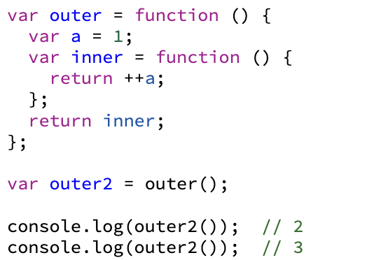
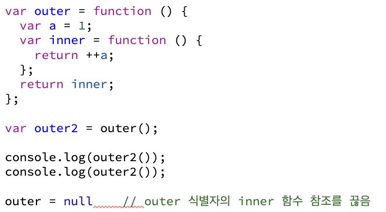
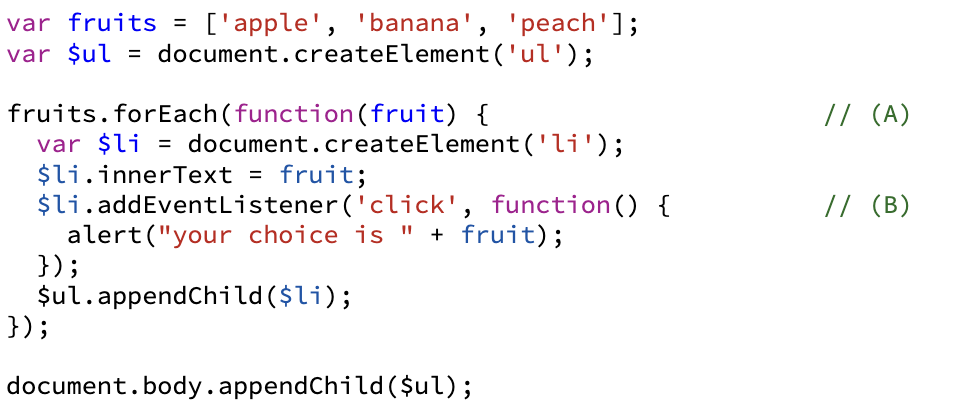
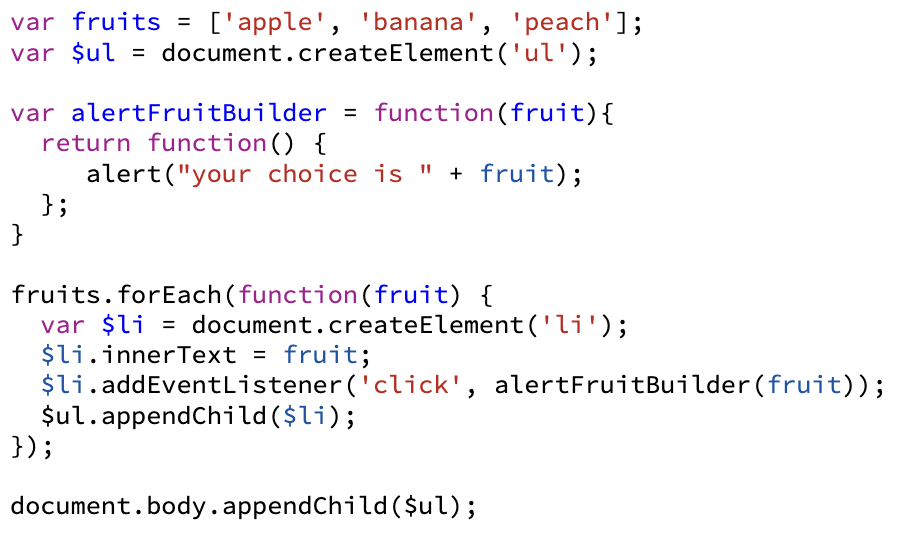

# 5장 클로저

 

## 1. 클로저의 의미 및 원리

클로저는 함수와 그 함수가 선언될 당시의 lexical environment의 상호관계에 따른 현상이라고 MDN에 설명 되어있다.

- 예시 1-1 )
  

함수 outer의 내부 함수인 inner 함수에서는 a를 선언하지 않았기 때문에, environmentRecord에서 값을 찾지 못하므로, outerEnvironmentReference에 지정된 상위 컨텍스트인 함수 outer의 LexicalEnvironment에 접근해서 다시 a를 찾는다.

예시 1-1에서는 outer 함수의 실행 컨텍스트가 종료되기 이전에 inner 함수의 실행 컨텍스트가 종료되어 inner 함수를 호출할 수 없습니다. 그러면 outer함수의 실행 컨텍스트가 종료된 후에도 inner 함수를 호출할 수 있을지 아래 예시를 통해 확인해보자.

- 예시 1-2)
  

  예시 1-2에서는 inner 함수 자체를 반환하였고, outer 함수의 실행 컨텍스트가 종료될 때 outer2 변수는 inner 함수를 참조하게 될 것이다. 이후 outer2를 호출하면 반환된 함수인 inner 함수가 실행되고, inner 함수의 실행 시점에는 outer 함수는 이미 종료된 상태인데 outer 함수의 LexicalEnvironment에 접근할 수 있는 이유는 가비지 컬렉터의 동작 방식 때문이다. inner 함수의 실행 컨텍스트가 활성화되면 outer 함수의 LexicalEnvironment를 필요로 할 것이므로 수집 대상에서 제외된다.

* 클로저를 다시 정리해보면 어떤 함수 A에서 선언한 변수 a를 참조하는 내부 함수 B를 외부로 전달할 경우 A의 실행 컨텍스트가 종료된 이후에도 a가 사라지지 않는 현상을 말한다.

* 외부로 전달하는 경우에는 return 외에도, setInerval/setTimeout, eventListener 등이 있다.

---

## 2. 클로저와 메모리 관리

'메모리 누수'는 어떤 값의 참조 카운트가 0이 되지 않아 가비지컬렉터의 수거 대상이 되지 않는 것이다.

'메모리 소모'에 대한 관리법은 클로저가 참조하고 있는 변수를 참조 해제시키면 되는데, 참조 카운트를 0으로 만드는 방법을 이용할 수 있다. 식별자에 기본형 데이터 (null이나 undefined)를 할당하면 된다.

---

## 3. 클로저 활용 사례

- 예시 3-1)

예제 3-1 에서, 콜백 함수(B)에는 fruits라는 외부 변수를 참조하고 있으므로 클로저가 존재한다.

(A)는 fruits의 개수만큼 실행되며, 그때마다 새로운 실행 컨텍스트가 활성화되고, (B)가 실행될 때는 (B)의 outerEnvironmentReference가 (A)의 LexicalEnvironment를 참조하게 된다.

따라서 (B) 함수가 참조할 예정인 변수 fruits에 대해서 A가 종료된 후에도 가비지컬렉터 수집대상에서 제외된다.

- 예제 3-2)
  

예제 3-2는 콜백 함수를 고차 함수로 바꿔서 클로저를 활용한 예제이다.

addEventListener함수 안에서 콜백 함수로 alertFruitBuilder 함수를 실행하면서 fruit 값을 인자로 전달하고, 이후 클릭 이벤트가 발생하면 실행 컨텍스트가 활성화되면서 fruit를 outerEnvironmentReference에 의해 참조할 수 있어, alertFruitBuilder 실행 결과로 반환된 함수에는 클로저가 존재한다.

---

## 4.접근 권한 제어(정보 은닉)

정보은닉은 어떤 모듈의 내부 로직에 대해 외부로의 노출을 최소화해서 모듈 간의 겹합도를 낮추고 유연성을 높이기 위한 개념.

접근 권한에는 public, private, protected, 세 종류가 있다. 자바스크립트는 변수 자체에 이러한 접근 권한을 직접 부여하도록 설계되어 있진 않지만 클로저를 이용해 함수 차원에서 public 한 값과 private 한 값을 구분하는 것이 가능하다.

### 부분 적용 함수

### 커링 함수

### 정리
