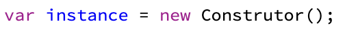
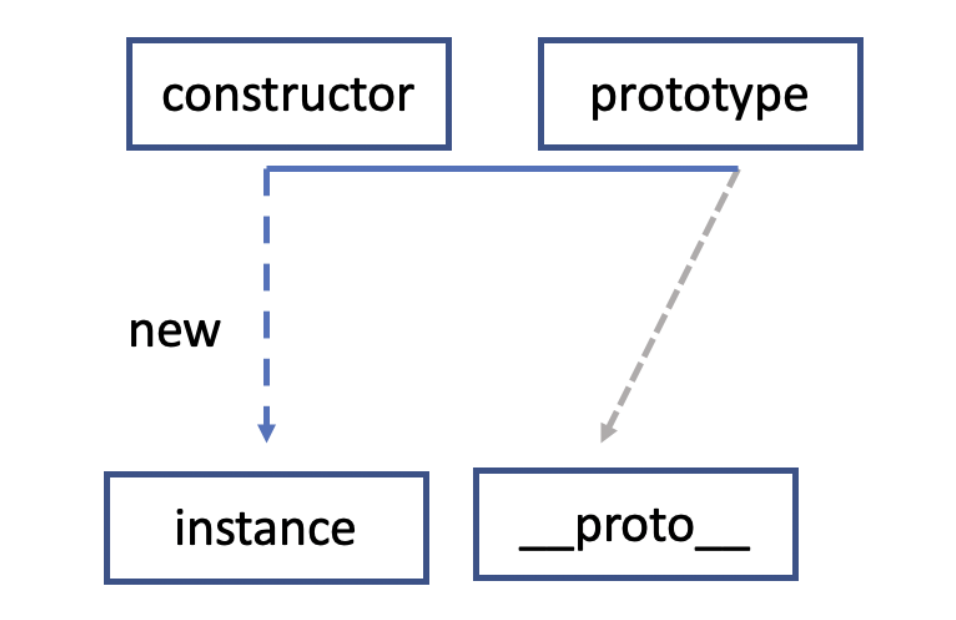
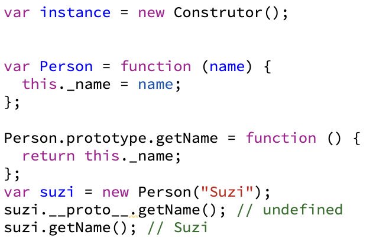
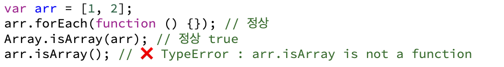
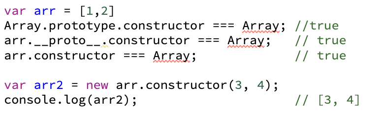

# 6장 프로토타입

 

## 프로토타입 개념 이해

자바스크립트는 프로토타입 기반 언어이다. 위키백과에서 프로토타입 기반 언어를 다음과 같이 설명한다.

클래스 기반 언어에서는 '상속'을 사용하지만 프로토타입 기반 언어에서는 어떤 객체를 prototype으로 삼고 이를 복제(참조)함으로써 상속과 비슷한 효과를 얻는다.

### constructor, prototype, instance

  

위 코드를 도식 형태로 표현하면 다음과 같다.

#### 프로토타입 도식

- 어떤 생성자함수(constructor)를 new 연산자와 함께 호출하면 새로운 instance가 생성된다.
- 이때 instance에는 **proto **라는 프로터피가 자동으로 부여된다.
- 이 프로퍼티는 contructor의 prototype 프로퍼티를 참조한다.

prototype 객체 내부에는 인스턴스가 사용할 메서드를 저장하고, 인스턴스에서도 **proto**를 통해 이 메서드들에 접근할 수 있게 된다.

- 클로저를 다시 정리해보면 어떤 함수 A에서 선언한 변수 a를 참조하는 내부 함수 B를 외부로 전달할 경우 A의 실행 컨텍스트가 종료된 이후에도 a가 사라지지 않는 현상을 말한다.

- 외부로 전달하는 경우에는 return 외에도, setInerval/setTimeout, eventListener 등이 있다.

 

위 이미지에서 suzi.**proto**.getName(); 이 undefined가 나왔다는 것은 이 변수가 '호출할 수 있는 함수'에 해당한다는 것을 의미한다.  
만약 실행할 수 없는, 즉 함수가 아닌 다른 데이터 타입이었다면 TypeError가 발생했을 것이다.

#### 왜 undefind가 출력될까 ?

- this에 바인딩된 대상이 잘못 지정됐기 때문이다. this는 suzi가 아닌 suzi.**proto**라는 객체이기 때문에 undefined가 반환된 것이다.

- **proto**는 생략 가능한 프로퍼티다. 따라서 생성자 함수의 prototype에 어떤 메서드나 프로퍼티가 있다면 인스턴스에서도 마치 자신의 것처럼 해당 메서드나 프로퍼티에 접근할 수 있게 된다.

 

- 위 예시에서 Array를 new 연산자와 함께 호출해서 인스턴스를 생성하든, 그냥 배열 리터럴을 생성하든, 어쨋든 인스턴스인 [1, 2]가 만들어진다.   이 인스턴스의 **proto**는 Array.prototype을 참조하는데 **proto**가 생략 가능하도록 설계돼 있기 때문에 인스턴스가 push, pop, forEach 등의 메서드를 마치 자신의 것처럼 호출할 수 있다.

- 한편 Array의 prototype 프로퍼티 내부에 있지 않은 from, isArray등의 메서드들은 인스턴스가 직접 호출할 수 없다. 이들은 Array 생성자 함수에서 직접 접근해야 실행이 가능하다.

---

### constructor 프로퍼티

 

생성자 함수의 프로퍼티인 prototype객체 내부에는 constructor라는 프로퍼티를 볼 수 있다.
이 특징으로는

- 원래의 생성자 함수를 참조하며 인스턴스로부터 그 prototype이 무엇인지 알 수 있고

- 읽기 전용 속성이 부여된 예외적인 경우( number, string, boolean )를 제외하고 값을 바꿀 수 있다.

---

## 프로토타입 체인

### 메서드 오버라이드

 

heejun.**proto**.getName이 아닌 heejun 객체에 있는 getName 메서드가 호출되는데 이러한 현상을 메서드 오버라이드라고 한다. 자바스크립트 엔진이 getName 이라는 메서드를 찾는 방식은 가장 가까운 대상인 자신의 프로퍼티를 검색하고, 없으면 그다음으로 가까운 대상인 **proto**를 검색하는 순서로 진행된다.

- 모든 객체의 **proto**에는 Object.prototype이 연결된다. 어떤 데이터의 **proto** 프로퍼티 내부에 다시 **proto** 프로퍼티가 연쇄적으로 이어진 것을 프로토타입 체인이라 하고, 이 체인을 따락며 검색하는 것을 프로토타입 체이닝이라고 한다. 프로토타입 체인상 가장 마지막에는 언제나 Object.prototype이 있다.

- 하지만 예외적으로 Object.create를 이용하면 Object.prototype의 메서드에 접근할 수 없는 경우가 있다. Object.create(null)은 **proto**가 없는 객체를 생성한다.
