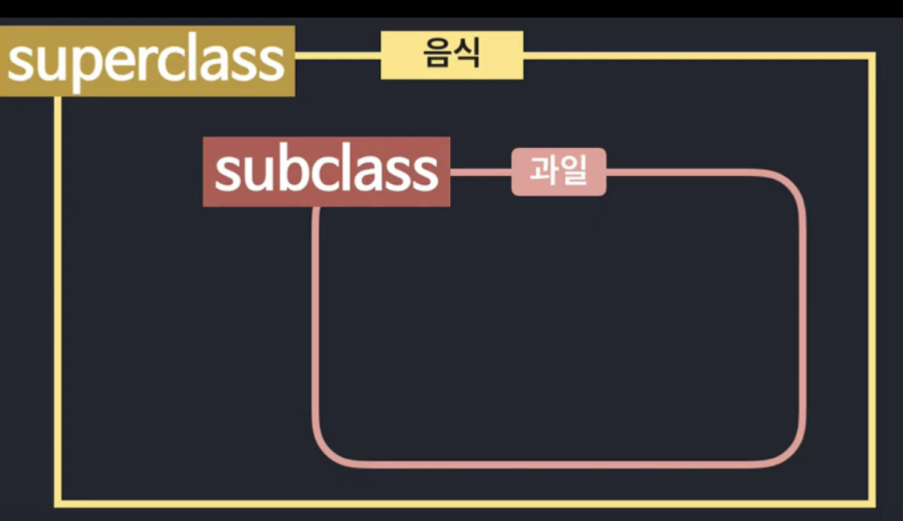
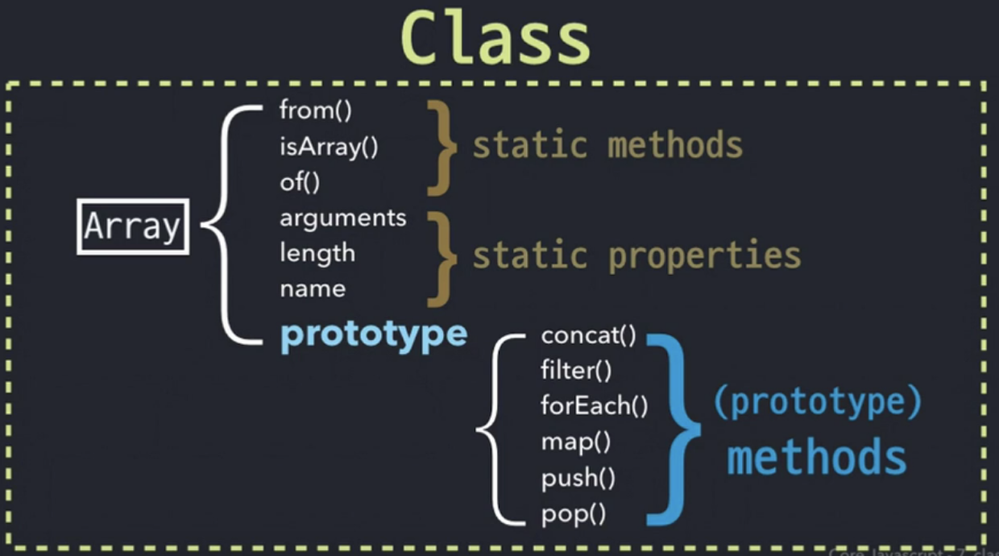
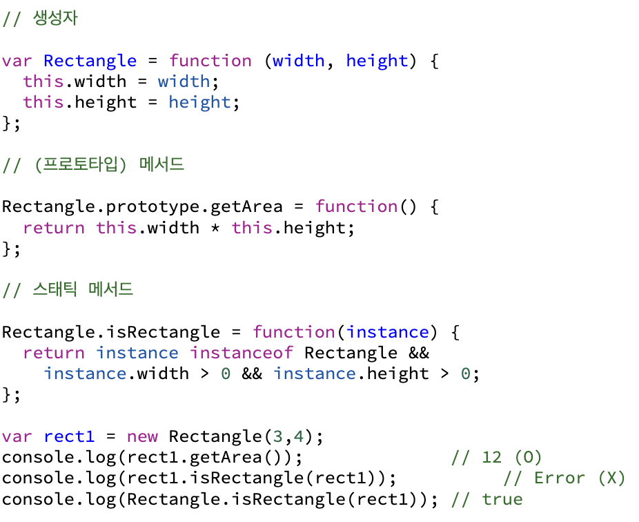
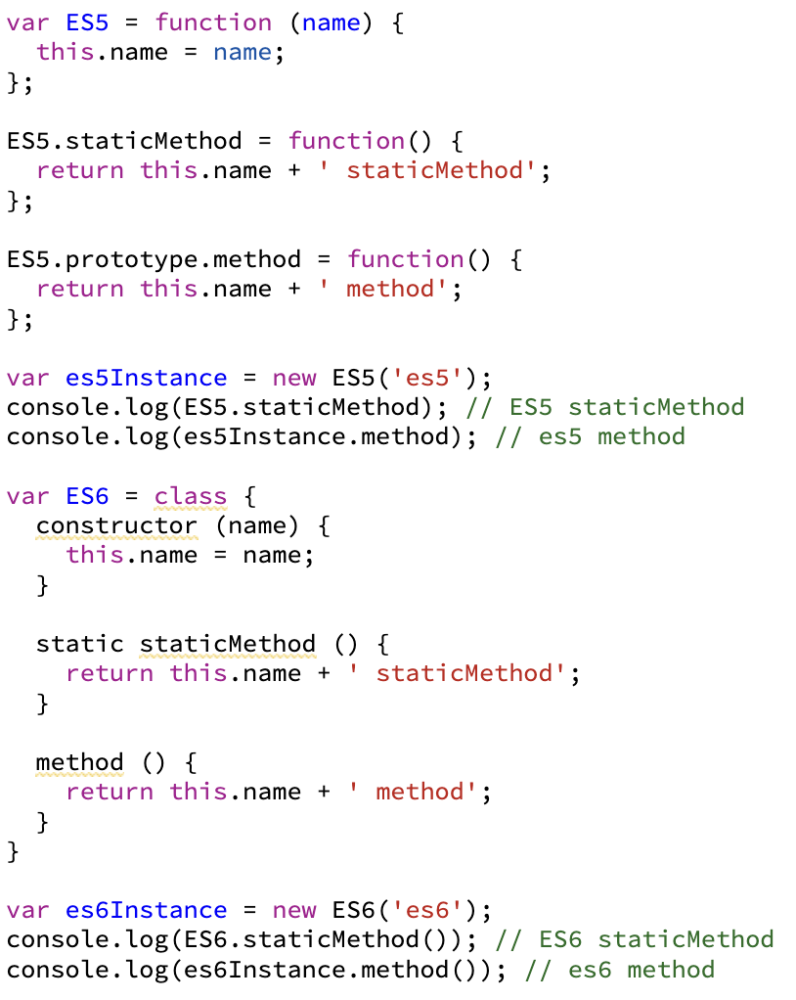
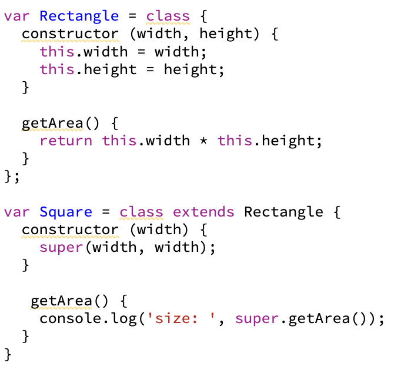

# 7장 클래스

 

## 클래스와 인스턴스의 개념 이해

자바스크립트는 프로토 타입 기반 언어라서 '상속'개념이 존재하지 않지만, ES6 이후 클래스 문법이 추가되고, 클래스 문법에서도 일정 부분은 프로토타입을 활용하고 있다.

class라는 의미는 '계급, 집단, 집합'등의 의미로 번역된다. 프로그래밍 언어적으로도 동일한 개념으로 접근하면 된다.

- 클래스(class)는 어떤 사물의 공통 특성을 모아 정의한 추상적인 개념이다. 상위 클래스(SuperClass)와 하위 클래스(SubClass)로 나뉠 수 있다.

- 인스턴스(instance)는 특정 클래스의 속성을 지니는 실존하는 사례이다.

클래스는 하위로 갈수록 상위 클래스의 속성을 상속하면서 구체적인 요건이 추가되거나 변경된다.

하나의 인스턴스는 하나의 클래스만을 바탕으로 만들어진다.

- 클래스와 클래스간의 상하관계 예시  

 

---

## 자바스크립트의 클래스

 

- 생성자 함수 Array를 new 연산자와 함께 호출하면 인스턴스가 생성.
- Array를 클래스라고 하면, Array의 prototype 객체 내부 요소들이 인스턴스에 '상속' 된다고 볼 수 있다. (엄밀히는 상속이 아닌 프로토타입 체이닝에 의한 참조이며 결과적으로는 동일하게 작동된다.)
- 인스턴스에 상속되는지(인스턴스가 참조되는지) 여부에 따라 스태틱 멤버(static methods와 static properties가 있는)와 프로토타입 메서드로 구분된다.

#### 프로토타입 클래스 적용 예시  

 

- getArea는 rect1.**proto**.getArea에 접근하는데, **proto**가 생략했으므로, this가 rect1인 채로 실행되어 해당 메서드의 값이 반환됩니다. 이처럼 인스턴스에 직접 호출할 수 있는 메서드가 프로토타입 메서드이다.

- rect1 인스턴스에서 isRectangle라는 메서드에 접근하고자 하는데 rect1에 isRectangle메서드가 있는지 검색했는데 없고, rect1.**proto**에도 없으며, Object.prototype에도 없는 걸 알고, 함수가 아니어서 실행할 수 없다는 에러가 발생한다. 이렇게 인스턴스에서 직접 접근할 수 없는 메서드를 스태틱 메서드라고 한다. 스태틱 메서드는 생성자 함수를 this로 해야만 호출할 수 있다.

---

## 클래스 상속

- 클래스 상속은 객체지향에서 가장 중요한 요소 중 하나이다.
- 클래스 상속을 흉내 내기 위한 세 가지 방법이 있다.

- SubClass.prototype에 SuperClass의 인스턴스를 할당한 다음 프로퍼티를 모두 삭제하는 방법
- 빈 함수(Bridge)를 활용하는 방법
- Object.create를 이용하는 방법

### ES6의 클래스 및 클래스 상속

#### ES5와 ES6의 클래스 문법 비교

  
  
- 클래스 문법에서 constructor는 ES5의 생성자 함수와 동일한 역할을 수행한다.
- static 키워드는 해당 메서드가 static 메서드임을 알리는 내용으로 생성자 함수(클래스) 자신만 호출할 수 있다.
- method()는  prototype 객체 내부에 할당되는 메서드로, 인스턴스가 프로토타입 체이닝을 통해 자신의 것처럼 호출할 수 있는 메서드이다.

#### ES6의 클래스 상속 예시

 

- ES6의 클래스 문법에서의 상속받는 SubClass를 만들기 위해 class 명령 뒤 extends 키워드와 상속받고 싶은 SuperClass를 적으면 상속 관계 설정이 끝난다.
- constructor 내부에서는 super라는 키워드를 함수처럼 사용할 수 있는데, 이는 SuperClass의 constructor를 실행한다.
- constructor 메서드를 제외한 다른 메서드에서는 super키워드를 마치 객체처럼 사용할 수 있고, 이때 객체는 SuperClass.prototype을 바라본다. 이때 호출한 메서드의 this는 "super"가 아니라 원래의 this를 그대로 따른다.
