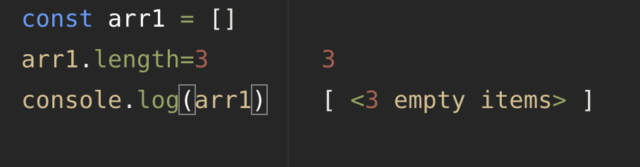

# 01장 데이터 타입
<br>
<br>
<br>

## 1-1 데이터 타입의 종류

<br>

자바스크립트의 데이터 타입에는 크게 2가지 타입이 있음

* 기본형
    * 숫자
    * 문자
    * 불리언
    * null
    * undefined 등과
    * ES6 추가 (Symbol)
* 참조형
    * 객체
    * 배열
    * 함수
    * 날짜
    * 정규표현식 등과
    * ES6 추가 (Map, WeakMap, Set, WeakSet 등)

### 기본형과 참조형 분류 기준

기본형은 할당이나 연산 시 복제되고 참조형은 참조된다고 알려져 있다. 둘 다 복제를 하지만, 기본형은 값이 담긴 주소값을 바로 복제하고, 참조형은 값이 담긴 주소값들로 이루어진 묶음을 가리키는 주소값을 복제함.

### 기본형은 불변성을 띔
이를 이해하려면 식별자와 변수의 개념 구분이 필수

---

<br>
<br>
<br>

## 1-2 데이터 타입에 관한 배경지식

<br>

### 2-1 메모리와 데이터

컴퓨터는 모든 데이터를 0과 1로 기억함. <br>
이때 하나의 메모리 조각을 비트라고 함. <br>
각 비트는 고유한 식별자를 통해 위치확인 가능 <br>
이를 몇 개씩 묶어 하나의 단위로 여긴다면 더욱 효율적일 것임<br>
하지만 너무 많은 비트를 한 단위로 묶이면 낭비되는 비트가 생김

메모리 용량이 훨씬 커진 상황에서 등장한 자바스크립트는 이러한 압박에서 상대적으로 자유로워짐<br>
숫자의 경우 정수형, 부동소수형을 구분치 않고 64비트, 즉 8바이트를 확보함.

모든 데이터는 바이트 단위의 식별자, 메모리 주소값을 통해 서로를 구분하고 연결할 수 있음

### 2-2 식별자와 변수

변수와 식별자를 혼동하는 경우가 많음. <br>
<br>
변수는 변할 수 있는 수. 반드시 값이 숫자여야 하는 것은 아님. 변할 수 있는 무언가이기 때문에, 그 무언가는 데이터까지로 의미가 확장됨 <br>
식별자는 어떤 데이터를 식별하는 데 사용하는 이름, 즉 변수명

---
<br>
<br>
<br>

## 1-3 변수 선언과 데이터 할당

<br>

### 3-1 변수 선언

선언 동작 방식에 대해 살펴보자
<br>

`const a;`
=> 변할 수 있는 데이터를 만드는데, 이 데이터의 식별자는 a라고 한다. <br>
변수란 결국 변경 가능한 데이터가 담길 수 있는 공간 또는 그릇

a라는 주소값 ( ex. 1003 ) 안에 가변할 수 있는 숫자를 저장하는 것이다.

### 3-2 데이터 할당

```
const a;
a='abc'
```
메모리에서 비어있는 공간을 확보하고 그 공간의 이름을 설정하는 선언 과정. <br>
여기에 데이터를 할당만 하면 될 것 같지만, 직접 저장하지는 않음
<br>
데이터를 저장하기 위한 별도의 메모리 공간을 다시 확보해 데이터를 저장하고, 그 주소를 변수 영역에 저장함
<br>
따라서 변수 영역과 데이터 영역으로 구분지을 수 있음.

<br>
<br>

1. 변수 영역에서 빈 공간을 확보한다.
2. 확보한 공간의 식별자를 a로 지정한다.
3. 데이터 영역의 빈 공간을 확보하여 문자열 'abc'를 지정한다.
4. 변수 영역에서 a 식별자를 검색한다.
5. 앞서 저장한 문자열의 주소를 변수 영역에 할당한다.

변수 영역에 바로 데이터를 할당하지 않고 따로 데이터 영역을 만드는 이유는 데이터 변환을 자유롭게 할 수 있게 할 뿐 아니라 메모리를 효율적으로 관리할 수 있기 때문.

만일 데이터 영역에서 변형이 일어난다 하면 무조건 새로운 데이터 영역에 새로운 데이터를 할당 한 후 새로운 주소값을 변수 영역에 할당한다. 추가 제거 상관 없이 새로운 데이터 영역을 만든다.

---

<br>
<br>
<br>
<br>

## 1-4 기본형 데이터와 참조형 데이터

<br>

### 4-1 불변값

변수와 상수를 구분하는 성질은 `변경 가능성`이다. 바꿀 수 있으면 변수, 바꿀 수 없으면 상수이다. <br>
불변값과 상수를 동일시 하기 쉬운데, 이는 명확히 구분할 필요가 있다. <br>
변수와 상수를 구분짓는 변경 가능성의 대상은 변수 영역 메모리다. <br>
불변성의 여부를 판단할 때 변경 가능성의 대상은 데이터 영역이다. <br>
기본형 데이터인 숫자, 문자열, 불리언, null, undefined, symbol은 모두 불변값

### 4-2 가변값

기본형 데이터는 모두 불변값이고, 참조형 데이터는 설정에 따라 불변값일 수도, 가변값일 수도 있다.

### 4-3 변수 복사 비교

참조형 데이터가 가변값이라고 설명할 때의 가변은 참조형 데이터 자체를 변경할 경우가 아니라 내부의 프로퍼티를 변경할 때만 성립

---

<br>
<br>
<br>
<br>

## 1-5 불변 객체

<br>

### 5-1 불변 객체를 만드는 간단한 방법

불변 객체는 최근 각 라이브러리나 프레임워크에서 뿐 아니라 함수형 프로그래밍 등에서도 기초가 되는 개넘. <br>
데이터 자체를 변경하고자 하면 기본형과 마찬가지로 기존 데이터는 변하지 않음.<br>
그렇다면 변경할 때마다 새로운 객체를 만들기로 규칙을 정한다면 불변성을 유지할 수 있을 것.

```
const user = {
  name: "jang",
  gender: 'male'
}

const ChangeName = function(user,name) {
  const newUser = user;
  newUser.name=name;
  return newUser
}

const user2 = ChangeName(user,"lee")
```

=> 기존의 user까지 모두 변형됨

```
const user = {
  name: "jang",
  gender: 'male'
}

const ChangeName = function(user,name) {
  return {
    name,
    gender: user.gender
  }
}

const user2 = ChangeName(user,"lee")
```
=> 기존의 user는 유지됨

### 5-2 얕은 복사와 깊은 복사

얕은 복사는 바로 아래 단계의 값만 복사하는 방법이고, 깊은 복사는 내부의 모든 값들을 하나하나 찾아서 전부 복사하는 방법.

ex.1-12 예제의 coptObject는 얕은 복사만 수행. <br>
=>  중첩된 객체에서 참조형 데이터가 저장된 프로퍼티를 복사할 때 그 주소값만 복사. <br> => 원본과 사본이 동일한 데이터의 주소를 가리킴 <br> => 사본을 바꾸면 원본도 같이 바뀜

어떠한 객체를 복사할 때 모든 값을 복사 후 새로운 데이터를 만들고자 한다면, 참조형 데이터일 경우는 내부의 프로퍼티들을 복사해야 한다.

---

<br>
<br>
<br>
<br>

## 1-6 undefined와 null

<br>

undefined와 null 모두 없음을 나타내는 값.

undefined는 명시적으로 지정할 수도 있지만 자바스크립트 엔진이 자동으로 부여할 수도 있음
<br>
자바스크립트 엔진은 사용자가 응당 어떤 값을 지정할 것이라고 예상되는 상황임에도 실제로 그렇게 하지 않을 때 undefined를 반환함.

1. 값을 대입하지 않은 변수. 즉, 데이터 영역의 메모리 주소를 지정하지 않은 식별자에 접근할 때
2. 객체 내부의 존재하지 않는 프로퍼티에 접근하려 할 때
3. return문이 없거나 호출되지 않는 함수의 실행 결과

<br>
=> empty와 undefined는 또 다른 경우이다. 위의 경우는 undefined조차 할당되어 있지 않은 상황.

```
const n = null
console.log(typeof n) // object

console.log(n == undefined) // true
console.log(n == null) // true

console.log(n === undefined) // false
console.log(n === null) // true
```

---

<br>
<br>
<br>
<br>

## 1-7 정리

<br>

변수는 변경 가능한 데이터가 담길 수 있는 공간이고, 식별자는 그 변수의 이름을 말함.

---

<br>
<br>
<br>